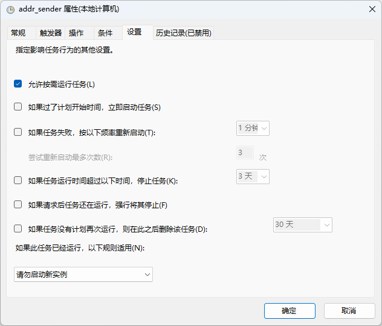

# IP地址自动发送小程序

> 该程序只针对windows系统设计，移植到Linux系统需要修改
>  
> - addr_sender.py中的get_wlan_setting()、check_and_send()的相关字段或匹配规则
> - Windows任务计划程序改为Linux计划任务

## 1 需要安装的库

`pip install schedule`
`pip install pyinstaller`

## 2 填写邮箱相关信息

在下图位置填写邮箱信息，其中`stmp.XXX.com`为邮箱SMTP服务器地址，`XXX@XXX.XXX`为邮箱地址（可以自己给自己发），`XXX`为邮箱授权码（具体可去邮箱安全设置中找）。

## 3 生成可执行文件

`pyinstaller -F task.py`，然后在`./dist`文件夹中找到`tast.exe`，把它复制/剪切到目标文件夹。

## 4 加入任务计划程序

最后点击确定然后启动任务计划程序检验是否正常工作。

## 注：安全性考虑

在网络传输明文终究是不让人放心的，建议使用`cryptography.fernet`对字符串进行简单的加密处理。
